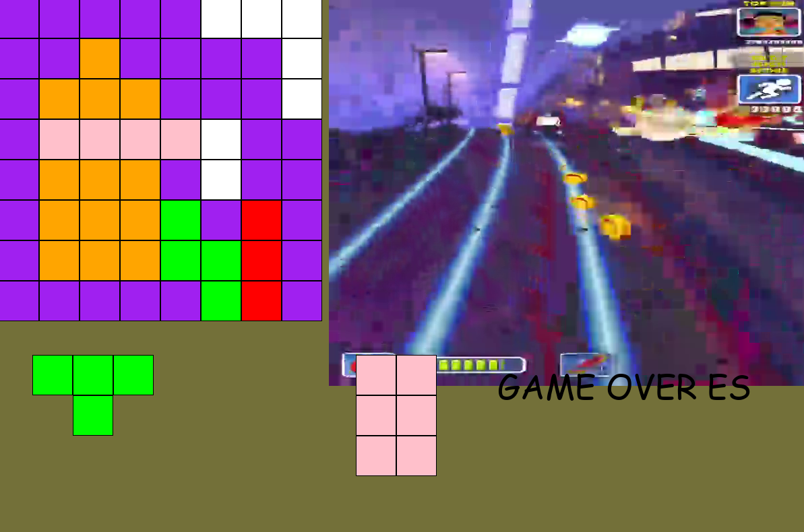

# Block Blast Python 🎮🧱

Block Blast Python is a classic block puzzle game developed in Python using the Pygame library. The goal is to strategically place various-shaped blocks onto an 8x8 grid to clear full rows and columns, earning points as you go. Test your spatial reasoning and see how high you can score before running out of moves!

## Features ✨

* **Classic Block Puzzle Gameplay:** Place diverse block shapes onto a grid.
* **Line & Column Clearing:** Clear full rows and columns to score points.
* **Dynamic Scoring System:** Points are awarded for cleared lines and columns.
* **Intuitive Drag-and-Drop:** Easily move and place blocks using your mouse.
* **Game Over Condition:** The game ends when no more blocks can be placed on the board.
* **Visual Feedback:** Blocks change appearance on hover for potential placement.
* **Randomized Block Generation:** New sets of three unique blocks are generated when needed.
* **Animated Background:** A subtle, color-changing background enhances the visual experience.
* **Background Video Integration:** (Optional) A video can play in the background for added flair.

## Screenshots 📸



## Prerequisites 🛠️

Before running the game, ensure you have:

* **Python 3.x** 🐍
* **Pygame library:** For game development.
* **OpenCV Python (`opencv-python`):** Required for playing the background video.

You can install the necessary Python libraries using pip:

```bash
pip install pygame opencv-python
````

## Setup and Running 🚀

1.  **Clone the repository (or download the files):**
    ```bash
    git clone <your-repo-url>
    cd BlockBlast-Python
    ```
2.  **Place Assets:**
      * Ensure `icon.png` (game icon) is in the same directory as `main.py`.
      * (Optional) If you want the background video feature, place `video.mp4` in the same directory as `main.py`. If this file is missing, the game will still run but without the video background.
3.  **Run the game:**
    ```bash
    python main.py
    ```

## How to Play ▶️

  * **Objective:** Place all three generated blocks onto the 8x8 grid to clear full rows and columns.
  * **Controls:**
      * **Mouse Drag:** Click and drag a block from the selection area onto the main grid.
      * **Mouse Release:** Release the mouse button to place the block. If the placement is valid, the block will lock into place. If not, it will return to its original position.
      * **`R` key:** Resets the game and score.
      * **(Debug) `RIGHT` arrow key:** Attempts to auto-place the first available block.
      * **(Debug) `UP`/`DOWN` arrow keys:** Print debug information to the console.

## Project Structure 📁

  * `main.py`:
      * The main entry point of the game.
      * Handles the Pygame initialization, game loop, event processing (mouse clicks, keyboard input), and rendering of game elements.
      * Manages the overall game state, including score and block generation.
      * Integrates the `blocklib` module for core game logic.
  * `blocklib.py`:
      * Defines the core game entities:
          * `Block`: Represents a single square unit on the grid.
          * `Shape`: Represents a collection of `Block` objects forming a specific puzzle piece.
          * `map`: Represents the game board, managing the state of each grid cell.
      * Contains functions for:
          * Checking block collisions and clicks.
          * Updating block positions.
          * Determining valid placement locations (`getAvaliable`, `simulatePlace`).
          * Placing blocks on the map (`mapPlace`, `mapPlaceAuto`).
          * Checking for cleared rows/columns and calculating scores (`checkWin`).
          * Determining if a game is still possible with current blocks (`checkPossibility`).
          * Generating new sets of blocks (`genBlocks`).

## Important Notes ⚠️

  * **Asset Paths:** The game expects `icon.png` and `video.mp4` to be in the same directory. If you move them, you'll need to adjust the `resource_path` function in `main.py`.
  * **Debug Keys:** Several keyboard shortcuts (`UP`, `DOWN`, `R`, `RIGHT`) are currently used for debugging purposes. These might be removed or changed in future versions.
  * **Video Playback:** The background video is a simple loop. Performance may vary depending on your system and video file.

## Todo List ✅

  * **Refine Block Placement:** Improve the logic for blocks returning to their original position if placement is invalid.
  * **Optimize Score Calculation:** Review and fix the score calculation logic within `checkPossibility`.
  * **Remove Debugging Tools:** Clean up and remove the debugging key bindings from `main.py` before a release.
  * **Enhance UI/UX:**
      * Add a clearer "Game Over" screen.
      * Implement sound effects for block placement, line clears, etc.
      * Improve visual feedback for score updates.
  * **Difficulty Scaling:** Consider introducing increasing difficulty (e.g., more complex shapes, faster pace).
  * **Persistence:** Add a high score saving feature.

## Contributing 🤝

Contributions are welcome\! If you have suggestions for improvements, bug fixes, or new features, please feel free to:

1.  Fork the repository.
2.  Create a new branch (`git checkout -b feature/YourFeature`).
3.  Make your changes.
4.  Commit your changes (`git commit -m 'Add Your Feature'`).
5.  Push to the branch (`git push origin feature/YourFeature`).
6.  Open a Pull Request.

## License 📄

This project is open-source and available under the [MIT License](https://opensource.org/licenses/MIT).
